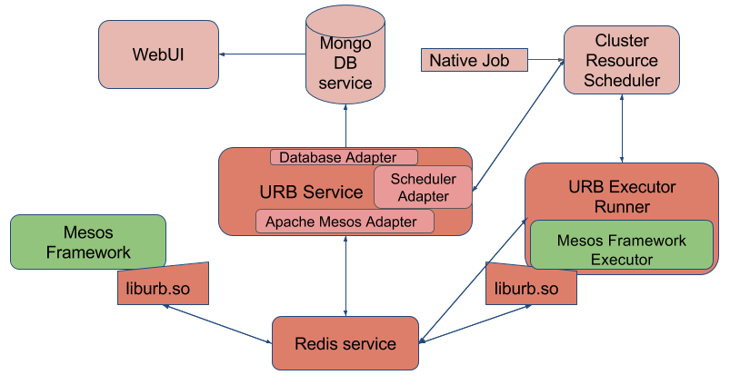

# Universal Resource Broker
======

# Introduction

Universal Resource Broker (URB) provides an API for developing and running distributed applications.  URB exposes
both a resource requesting and resource providing pluggable interface giving the ability to map multiple
distrubted resource API's to a single resource provider.  Universal Resource Broker is an enterprise ready application
engine for your datacenter.

Presently URB supports an Apache Mesos API compatible resource requesting plugin as well as a Univa Grid
Engine and localhost backend.  A Kubernetes backend is actively being developed.

This project includes Universal Resource Broker core components only. For the Universal Resource Broker to be
fully functioning the scheduler back end adapter has to be implemented in Python, based on interface located in
`source/python/urb/adapters/adapter_interface.py`.

Structurally it is recommended to create a separate project with an adapter interface implementation and
use urb-core as an external dependency (similarly to [urb-uge](https://github.com/UnivaCorporation/urb-uge) project).

# Functionality

Universal Resource Broker software provides the following high level functionality:

- Complete _Scheduler_ and _Executor_ API's for building distributed applications. URB supports applications written in C++, Java, Scala, and Python.
- Application _Frameworks_ implement the _Scheduler API_ and start _Executors_ on offered resources from URB.
- _Executors_ implement the _Executor API_ and perform the actual work required by the application.
- Ability to run existing Apache Mesos Frameworks without requiring any modifications.
- Ability to integrate with different resource schedulers by implementing the adapter interface for all resource allocation, scheduling, access control, and policy decisions.
- Ability to integrate with different database backends to store historical information about the workloads (MongoDB is interfaced by default, requires external Mongo server)
- Provides unified environment for the back end scheduler and Apache Mesos workloads in the cluster:
    - Single resource pool
    - Single accounting and reporting database
    - Single scheduler configuration interface
- Configurable for High Availability support with automatic service failover

URB is compatible with Linux, Solaris and other UNIX like operating systems.

# Concepts

The URB system is designed around a three key requirements:

- Support existing Apache Mesos Frameworks
- Provide interface to extarnal resource allocator, scheduler, and launcher of all user applications
- Provide support for future application development API's

These requirements are implemented through the following components:

- The URB Service responsible for managing the lifecycle of all Frameworks and interfacing with pluggable scheduler
- The URB C++ shared library linked by all Frameworks in order to access the URB Service
    - Standard library implementing published interface
    - Extended library implementing all Apache Mesos binary symbols (not built by default, requires prebuilt Mesos binaries)
- The URB native Java bindings providing support for Java based Frameworks
- The URB native Python bindings providing support for Python based Frameworks
- Helper programs to create an Apache Mesos compatible execution environment
    - Executor Runner application that talks to the URB Service to manage the lifecycle of an executor
    - Fetcher application that handles the download and optional extraction of executors specified by URI
    - Command Executor that handles the running of bare system commands

## What is a Framework?

The term Framework is used to describe an integration that maps the functionality of an application (i.e. Apache Hadoop, Jenkins, Apache Spark) to a distributed set of resources. Frameworks are responsible for selecting available resources and then launching **work** on those resources.  Each unit of work is called a **task**. A Framework is application specific and must minimally implement the _Scheduler API_ to register with Universal Resource Broker and receive resources.  For trivial Frameworks a simple default executor implemenation exists, the _Command Executor_ which allows for the execution of system commands.  When using the _Command Executor_ each **task** maps to a single _Command Executor_ and system call.  Alternatively a Framework may provide an executor program implementing the _Executor API_.  In contrast to the one-to-one **task** to executor requirement of the _Command Executor_ an executor program can, and typically does, handle multiple **tasks** in a single process.  Additionally an executor program can support multiple concurrent tasks run under a concurrency paradigm (i.e. threading, subprocesses, coroutines).  URB currently supports Apache Mesos Frameworks.

## How are Apache Mesos Frameworks Supported in URB

All Apache Mesos Frameworks must implement the _Scheduler API_ and optionally, the _Executor API_.  Both API's are provided through a C++ shared library with native wrappers for both Python and Java.  The shared library additionally contains functionality that invokes the methods of the API thus connecting the Framework to the URB Service.

Universal Resource Broker and Apache Mesos have different strategies for mapping user submitted _work_ to datacenter resources.  Specifically Apache Mesos implements an _offers_ scheme where all available datacenter resources are offered to all of the registered Frameworks and the Frameworks select the resources they want while most of the other resource schedulers grant resources based on job requirements.  In order to support unmodified Apache Mesos Frameworks URB maps _offers_ to pluggable resource scheduler using the following strategy:

- When a Framework performs its registration process Universal Resource Broker looks at its configuration data and begins generating Framework
  specific _speculative offers_.  These _speculative offers_ do not represent real resources; they are simply used
  to test the Framework to see if the Framework is looking to run more **work**.  The values used to populate
  the offer come first from the Framework specific configuration section with a fall back to the default
  section if none is found.  The configuration determines how much memory, cpus, ports,
  and number of resources are speculatively offered.  Through the lifecycle of the Framework *speculative
  offers* are sent whenever there are no pending jobs in the resource provider for a given Framework.
- If the Framework attempts to start work on a _speculative offer_ the URB Service submits a job to
  the resource provider based again on the configuration parameters defined in URB Service configuration.
- Based on Framework configuration a **TASK_LOST** message may be generated for the accepted speculative offer.
  The **TASK_LOST** tells the Framework that this launch failed and it should try again.  The purpose of
  sending the **TASK_LOST** message is to support Frameworks that need to know the hostname and port of their
  resources.  Since the _speculative offer_ is done against a non-existant resource the hostname and port are
  not valid.  The URB Service supports not sending this message if the Framework doesn't need the
  hostname and port information thus saving an additional set of messages to re-submit the task.
- Once the pluggable resource provider job starts up the initial tasks are immediately run.  The system tracks the amount of
  resources managed for each job and how much each task consumes.  The running jobs are re-offered whenever
  they have surplus capacity.  Additionally whenever a job starts, a configurable number of new jobs can be
  submitted.  This allows for a rapid 'scale up' when a Framework has work to do.
- When the Framework starts to scale back due to a lack of work it should begin refusing offers from running
  jobs.  After the reception of a configurable number of offer refusals a job will exit thus freeing
  resources.
- Once all Framework **work** has completed all jobs will exit and the _speculative offers_ will start again.
- When the Framework unregisters all offers will stop.

# Architecture
The Universal Resource Broker system is made of several core architectural components.  These components are depicted in the following figure and described in detail in the following sections.

## URB Service
The URB Service is the core of the Universal Resource Broker system.  All other URB components communicate with the URB service through the URB API with the URB service managing the communication channels.  The URB service is implemented as a general purpose message handling driver with the ability to support multiple distributed Framework interfaces and resource backends.  In current version of URB only the Apache Mesos Framework interface is supported.

### Apache Mesos Framework Interface
The Universal Resource Broker Service is responsible for implementing the Apache Mesos Framework state machine that drives Apache Mesos Frameworks.  The vast majority of messages sent and received by this interface are JSON wrapped Apache Mesos messages.  The interface manages the following aspects of the Apache Mesos Framework state machine:

- Registration, Reregistration, and Unregistration of Apache Mesos Frameworks
- The generation of resource offers to be sent to Apache Mesos Frameworks
- The launching of tasks on a resource backend when Frameworks accept offers
- The registration and lifecycle management of the Executor Runners which provide an execution environment capable of starting a Apache Mesos Executor
- The registration and lifecylce management of Apache Mesos Executors
- Sending tasks to Apache Mesos Executors

### Scheduler Adapter Interface
A Scheduler Adapter interface is responsible for connecting URB Service to the Cluster Resource Scheduler backends. Only interface API is provided by the project. It has to be implemented separately for a Cluster Resource Scheduler of your choice.

## liburb.so - Universal Resource Broker API
The URB API manages all network communication between Framework components in the Universal Resource Broker system.  It is implemented both in the shared C++ library (liburb.so) linked by _Schedulers_ and _Executors_ (instead of stock Mesos libmesos.so library) and inside of the URB Service.  The API is responsible for translating the native handler interfaces to JSON encapsulated messages.  The messages are sent to and received from a Redis powered message queue.  No Universal Resource Broker components talk directly to other URB components as all communication passes through the URB API and Redis.

## Redis Message Queue
The Redis key value store server ([website](http://redis.io/)) is used to implement and operate the message queue used by the URB API.  All components communicating on the message bus first create _endpoints_.  The _endpoints_ manage message queue topics that are represented as Redis lists.  The flow of messages is arranged in a star pattern with the Universal Resource Broker read topics in the center.

## URB Executor Runner
The Executor Runner is responsible for creating a _Executor_ compatible runtime environment performing the following tasks to achieve its goal:

- Register with the URB Service
- Listen for tasks to launch
- Fetch the _Executor_ specified in received tasks
- Optionally extract the downloaded _Executor_
- Build an bash environment to launch the _Executor_
- Launch the _Executor_
- Monitor the state of the _Exector_

The Executor Runner is the actual application that is run under Cluster Resource Scheduler and is submitted by the URB service.  Each Executor Runner will run until it is told to by the URB Service to shutdown due to the Executor Runner's Framework unregistering or the Executor Runner becoming idle and running no tasks for a period of time.

## Cluster Resource Scheduler
Cluster Resource Scheduler is an external resource manager, scheduler, and executor of all URB tasks.  It is interfaced through Scheduler Adapter module of the URB Service and has to be provided.  The URB Service leverages Cluster Resource Scheduler job submission, job deletion, online monitoring, and historical account to reliable launch and manage Framework tasks.

## Mesos Framework/Executor
Mesos Frameworks and Executors are written against the Apache Mesos _Scheduler_ and _Executor_ API and link against the URB API to access Universal Resource Broker through liburb.so shared library.

## Mongo Database
Optional service interfaced through Database Adapter for storing historical information.

## WebUI
Optional Web User Interface Service for visualizing historical information available in the database.

## Native Job
External job native to the Cluster Resource Scheduler.

# High Availability
High availability is achieved by making both the Redis Message Queue and the URB Service highly available.  Redis is made highly available by configuring the Redis Sentinel functionality and using Redis Sentinel URI's in both the URB Service and the Frameworks.  The URB service is made highly available by starting multiple concurrent URB Services. The URB services will elect a master with the non-master services assuming a cold standby role.  The non-master services leverage Redis to monitor the health of the master and will elect a new master if and when the active master becomes unresponsive.

# Build

Docker has to be installed since the project uses docker to host the CentOS 7 build environment.

Please read [vagrant/README.md](vagrant/README.md) file for build instructions.

The build process produces a distribution archive which includes following components:

- an archive with binary components: liburb.so, redis, fetcher, command executor, example frameworks
- an architecture specific and architecture independent archives with Python eggs for Mesos and all required dependencies
- Universal Resource Broker Service Python egg
- Python example framework
- URB Service example configuration files

# Run URB in the development environment

URB project includes _localhost_ implementation of the Scheduler Adapter Interface in `source/python/urb/adapters/localhost_adapter.py` which runs Mesos tasks on the local host as a simple example of custom scheduler implementation.

Assuming that URB build (`make`) succeeded following commands will start redis server and the URB service:

`cd /scratch/urb`

`source/cpp/3rdparty/redis/build/redis-2.8.18/src/redis-server&` - start redis server in background

`cd source/python`

`. ../../etc/urb.sh` - source URB development environment to set environment variables for URB configuration files (`etc/urb.conf` and `etc/urb.executor_runner.conf`) and Python path required by URB service

`python urb/service/urb_service.py` - run URB service

Open new host shell and login into vagrant development environment (`vagrant ssh`, `cd /scratch/urb`). Create Python virtual environment for URB executor runner:

`tools/venv.sh`

Following command will start a Mesos C++ example framework with 50 tasks that ping-pong a message with the framework:

`URB_MASTER=urb://$(hostname) LD_LIBRARY_PATH=/scratch/urb/source/cpp/liburb/build /scratch/urb/source/cpp/liburb/build/example_framework.test`

In order to be able to start Mesos Python example frameworks Python virtual environment has to be set up:

`cd /scratch/urb`

`tools/venv.sh`

Following command will start a Mesos Python example framework with 50 tasks that ping-pong a message with the framework:

`. venv/bin/activate`

`LD_LIBRARY_PATH=/scratch/urb/source/cpp/liburb/build /scratch/urb/source/cpp/liburb/python-bindings/test/test_framework.py urb://$(hostname)`

`deactivate`

Please note that the _localhost_ implementation of the Scheduler Adapter Interface is limited to running example frameworks and doesn't guarantee correct behaviour when running actual Mesos frameworks.

